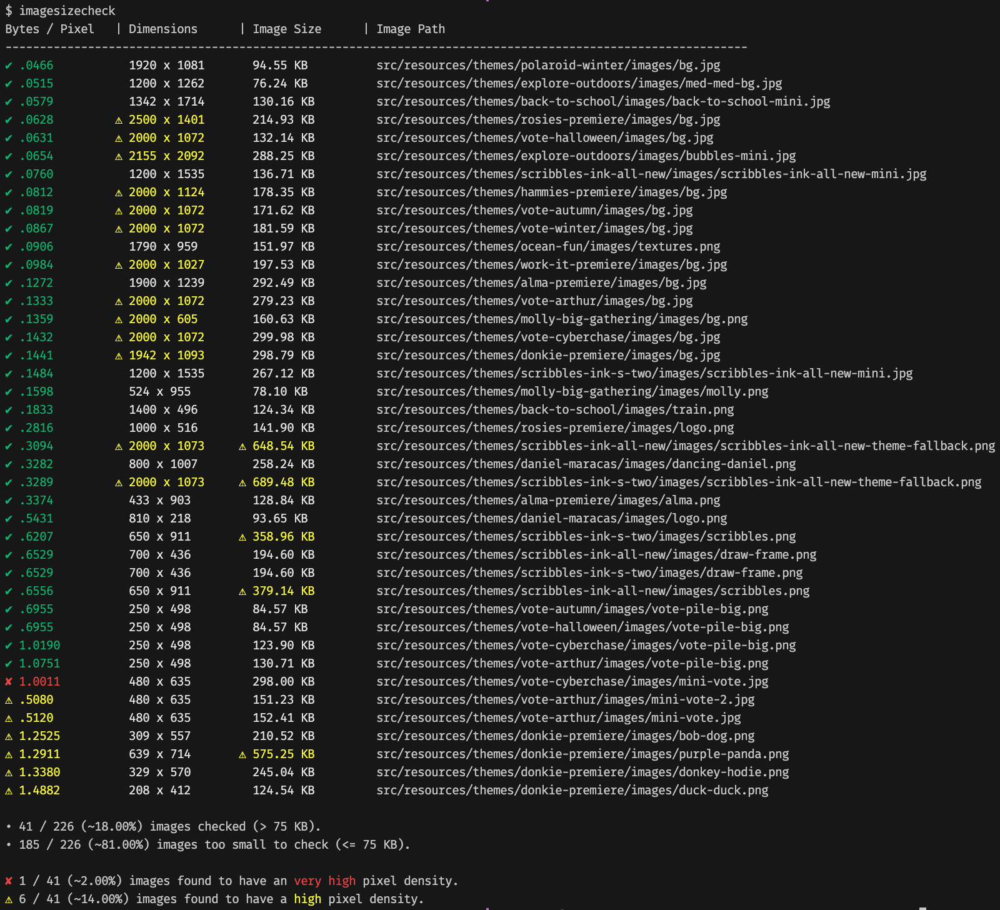

# `imagesizecheck`

`imagesizecheck` is a Bash script with the goal of making it easy to identify images that may benefit from higher levels of compression. It is aimed at web developers who want to ensure that their images are sufficiently compressed in order to be easily served over the web. At this time, JPEG and PNG images are supported.

## Requirements

* Bash 3.2+. You probably have this or a newer version. 3.2 is currently shipping with macOS.
* ImageMagick. Tested on 6.9.11-60, 7.1.1-9, and 7.1.1-12 but probably works with newer and older versions. On macOS, you can install it with Homebrew:

  ```bash
  brew install imagemagick
  ```

  For other platforms see: <https://imagemagick.org/script/download.php>.

## Installation

Once you have installed ImageMagick, copy the script `imagesizecheck` into a directory included in your `$PATH`, such as `/usr/local/bin` and ensure it has execution permission:

```bash
chmod +x /usr/local/bin/imagesizecheck
```

## Usage

Typically you'll just run `imagesizecheck` from a directory tree that contains images of interest. To see how the optional parameters work, run:

```bash
imagesizecheck --help
```

## How It Works

Simply run `imagesizecheck` in your terminal from a directory tree containing images, and you'll see a text-based table that recursively lists detailed image data for any image file found.

### Detailed Image Data? What Does That Mean?

The first three metrics use a color code system to indicate how well each image is suited to transmitting over the web, and that system is outlined below.

#### Pixel Density (bytes per pixel or Bpp)

This is the primary metric of interest and is measured in bytes per pixel. It is calculated thusly: filesize in bytes / (width in pixels * height in pixels). The lower this number, the better. By default, images are sorted by this field with the most efficiently compressed images at the top of the list.

* Red: "Very high" density - JPEG: exceeds 0.8 Bpp | PNG: exceeds 2.5 Bpp.
* Yellow: "High" density - JPEG: exceeds 0.4 Bpp | PNG: exceeds 1.25 Bpp.
* Green: "Low" density - does not exceed red and yellow thresholds. This is the target for most images.

#### Image Dimensions (width x height in pixels)

* Red: Either dimension exceeds 3840 pixels.
* Yellow: Either dimension exceeds 1920 pixels.
* White: both width and height are smaller than red and yellow thresholds. This is the target for most images.

#### Filesize (in kilobytes)

* Red: exceeds 700 KB.
* Yellow: exceeds 350 KB.
* White: does not exceed red and yellow thresholds. This is the target for most images.

#### Image Path

* Not color coded. This is simply the relative path to the image file.

### Example Output



### What Do I Do With Output From This Tool?

It is acknowledged that these thresholds are opinionated and disputable, however we need a starting point in order to visualize where higher levels of image compression might be needed. Notably, when the current thresholds outlined above are applied to 7,214 PBS KIDS website images, only about 3% are flagged "very high" density while only 8% are flagged "high" density. Most of the flagged images were from pretty old websites, which makes sense because the web performance initiatives taken on by many companies, including PBS KIDS, started in only the last few years.

Feedback on this script and these thresholds is welcome. Sometimes an image will be flagged that just won't be compressible to the "green level", and that's okay, but we should hope to make that the minority of images. Happy optimizing!
